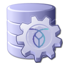

[](https://github.com/cockroachlabs-field/spring-data-cockroachdb/actions/workflows/maven.yml)

# Spring Data CockroachDB



The primary goal of the [Spring Data](https://projects.spring.io/spring-data) project is to make it easier to build
Spring-powered applications that use new data access technologies such as relational databases, non-relational databases, 
map-reduce frameworks, and cloud based data services.

The Spring Data CockroachDB project aims to provide a familiar and consistent Spring-based programming model for
CockroachDB as a SQL database.  

CockroachDB is a distributed SQL database built on a transactional and strongly-consistent key-value store. 
It scales horizontally; survives disk, machine, rack, and even datacenter failures with minimal latency disruption 
and no manual intervention; supports strongly-consistent ACID transactions; and provides a familiar SQL API for 
structuring, manipulating, and querying data.

## Disclaimer

This project is not officially supported by Cockroach Labs. Use of this library and the JDBC driver is entirely 
at your own risk and Cockroach Labs makes no guarantees or warranties about its operation.

See [MIT](LICENSE.txt) license for terms and conditions.

## Features

* Bundles the [CockroachDB JDBC driver](https://github.com/cockroachlabs-field/cockroachdb-jdbc)
* Meta-annotations for declaring:
  * Retryable transactions
  * Read-only transactions 
  * Strong and stale follower-reads
  * Custom session variables including timeouts
* AOP aspects for: 
  * Retrying transactions on serialization conflicts
  * Configuring session variables, like follower-reads
* Connection pool factory for HikariCP 
* Datasource proxy logging via TTDDYY
* Simple JDBC shell client for adhoc queries and tests

## Getting Started

Here is a quick teaser of an application using Spring Data JPA Repositories in Java:

```java
@Repository
public interface AccountRepository extends JpaRepository<Account, UUID> {
    Optional<Account> findByName(String name);

    @Query(value = "select a.balance "
            + "from Account a "
            + "where a.id = ?1")
    BigDecimal findBalanceById(UUID id);

    @Query(value = "select a.balance "
            + "from account a AS OF SYSTEM TIME follower_read_timestamp() "
            + "where a.id = ?1", nativeQuery = true)
    BigDecimal findBalanceSnapshotById(UUID id);

    @Query(value = "select a "
            + "from Account a "
            + "where a.id in (?1)")
    @Lock(LockModeType.PESSIMISTIC_READ)
    List<Account> findAllForUpdate(Set<UUID> ids);
}

@Service
public class AccountService {
    @Autowired
    private AccountRepository accountRepository;

    @NotTransactional
    public Account create(Account account) {
        return accountRepository.save(account);
    }

    @NotTransactional
    public Account findByName(String name) {
        return accountRepository.findByName(name)
                .orElseThrow(() -> new ObjectRetrievalFailureException(Account.class, name));
    }

    @NotTransactional
    public Account findById(UUID id) {
        return accountRepository.findById(id).orElseThrow(() -> new ObjectRetrievalFailureException(Account.class, id));
    }

    @TransactionBoundary
    @Retryable
    public Account update(Account account) {
        Account accountProxy = accountRepository.getReferenceById(account.getId());
        accountProxy.setName(account.getName());
        accountProxy.setDescription(account.getDescription());
        accountProxy.setBalance(account.getBalance());
        accountProxy.setClosed(account.isClosed());
        return accountRepository.save(accountProxy);
    }

    @NotTransactional
    public BigDecimal getBalance(UUID id) {
        return accountRepository.findBalanceById(id);
    }

    @TransactionBoundary(timeTravel = @TimeTravel(mode = TimeTravelMode.FOLLOWER_READ), readOnly = true)
    public BigDecimal getBalanceSnapshot_Explicit(UUID id) {
        return accountRepository.findBalanceById(id);
    }

    @NotTransactional
    public BigDecimal getBalanceSnapshot_Implicit(UUID id) {
        return accountRepository.findBalanceSnapshotById(id);
    }

    @TransactionBoundary
    public void delete(UUID id) {
        accountRepository.deleteById(id);
    }

    @TransactionBoundary
    public void deleteAll() {
        accountRepository.deleteAll();
    }
}

@Configuration
@EnableTransactionManagement(order = AdvisorOrder.TRANSACTION_ADVISOR)
@EnableJpaRepositories(basePackages = {"org.acme.bank"})
public class BankApplication {
    @Bean
    public TransactionRetryAspect retryAspect() {
        return new TransactionRetryAspect();
    }

    @Bean
    public TransactionBoundaryAspect transactionBoundaryAspect(JdbcTemplate jdbcTemplate) {
        return new TransactionBoundaryAspect(jdbcTemplate);
    }
}
```

## Maven configuration

Add this dependency to your `pom.xml` file:

```xml
<dependency>
    <groupId>io.cockroachdb</groupId>
    <artifactId>spring-data-cockroachdb</artifactId>
    <version>{version}</version>
</dependency>
```

Then add the Maven repositories to your `pom.xml` file (alternatively in Maven's [settings.xml](https://maven.apache.org/settings.html)):

```xml
<repositories>
    <repository>
        <id>cockroachdb-jdbc</id>
        <name>Cockroach Labs Maven Packages</name>
        <url>https://maven.pkg.github.com/cockroachlabs-field/cockroachdb-jdbc</url>
        <snapshots>
            <enabled>true</enabled>
        </snapshots>
    </repository>
    <repository>
        <id>spring-data-cockroachdb</id>
        <name>Cockroach Labs Maven Packages</name>
        <url>https://maven.pkg.github.com/cockroachlabs-field/spring-data-cockroachdb</url>
        <snapshots>
            <enabled>true</enabled>
        </snapshots>
    </repository>
</repositories>
```

Finally, you need to authenticate to GitHub Packages by creating a personal access token (classic)
that includes the `read:packages` scope. For more information, see [Authenticating to GitHub Packages](https://docs.github.com/en/packages/working-with-a-github-packages-registry/working-with-the-apache-maven-registry#authenticating-to-github-packages).

Add your personal access token to the servers section in your [settings.xml](https://maven.apache.org/settings.html):

```xml
<server>
    <id>github</id>
    <username>your-github-name</username>
    <password>your-access-token</password>
</server>
```
Take note that the server and repository id's must match (it can be different than `github`).

Now you should be able to build your own project with the JDBC driver as a dependency:

```shell
mvn clean install
```

Alternatively, you can just clone the repository and build it locally using `mvn install`. See
the building section at the end of this page.

## Getting Help

### Reporting Issues
                                                             
Spring Data CockroachDB uses [GitHub](https://github.com/cockroachlabs-field/spring-data-cockroachdb/issues) as issue tracking system 
to record bugs and feature requests. If you want to raise an issue, please follow the recommendations below:

* Before you log a bug, please search the [issue tracker](https://github.com/cockroachlabs-field/spring-data-cockroachdb/issues) 
to see if someone has already reported the problem.
* If the issue doesn’t exist already, [create a new issue](https://github.com/cockroachlabs-field/spring-data-cockroachdb/issues). 
* Please provide as much information as possible with the issue report, we like to know the version of Spring Data 
that you are using and JVM version, complete stack traces and any relevant configuration information.
* If you need to paste code, or include a stack trace format it as code using triple backtick.

## Modules

There are several modules in this project:

### spring-data-cockroachdb

Provides a [Spring Data](https://projects.spring.io/spring-data) module for CockroachDB, bundling
the CockroachDB JDBC driver, connection pooling support via [Hikari](https://github.com/brettwooldridge/HikariCP) 
and meta-annotations and AOP aspects for client-side retry logic, as an alternative to JDBC 
driver level retries.

### spring-data-cockroachdb-shell

An interactive spring shell client for adhoc SQL queries and CockroachDB settings and metadata 
introspection using the CockroachDB JDBC driver.

### spring-data-cockroachdb-distribution

Distribution packaging of runnable artifacts including the shell client and JDBC driver, in `tar.gz` format.
Activated via Maven profile, see build section further down in this page.

### spring-data-cockroachdb-it

Integration and functional test harness. Activated via Maven profile, see build section further down in this page.

## Versioning

This library follows [Semantic Versioning](http://semver.org/).

## Building from Source

Spring Data CockroachDB requires Java 17 (or later) LTS. 

### Prerequisites

- JDK17+ LTS for building (OpenJDK compatible)
- Maven 3+ (optional, embedded)

If you want to build with the regular `mvn` command,
you will need [Maven v3.x](https://maven.apache.org/run-maven/index.html) or above.

Install the JDK (Linux):

```bash
sudo apt-get -qq install -y openjdk-17-jdk
```

Install the JDK (macOS):

```bash
brew install openjdk@17 
```

### Dependencies
   
This project depends on the [CockroachDB JDBC driver](https://github.com/cockroachlabs-field/cockroachdb-jdbc)
which artifacts are available in [GitHub Packages](https://github.com/orgs/cockroachlabs-field/packages?repo_name=cockroachdb-jdbc).

### Clone the project

```bash
git clone git@github.com:cockroachlabs-field/spring-data-cockroachdb.git
cd spring-data-cockroachdb
```

### Build the project

```bash
chmod +x mvnw
./mvnw clean install
```

If you want to build with the regular mvn command, you will need [Maven v3.5.0](https://maven.apache.org/run-maven/index.html) or above.

### Build the distribution

```bash
./mvnw -P distribution clean install
```

The distribution tar.gz is now found in `spring-data-cockroachdb-distribution/target`.
           
## Examples

See spring-data-cockroachdb-examples.

## Run Integration Tests

The integration tests will run through a series of contended workloads to exercise the 
retry mechanism and other JDBC driver features.

First start a [local](https://www.cockroachlabs.com/docs/stable/start-a-local-cluster.html) CockroachDB node or cluster.

Create the database:

```bash
cockroach sql --insecure --host=localhost -e "CREATE database spring_data_test"
```

Then activate the integration test Maven profile:

```bash
./mvnw -P it clean install
```

See the [pom.xml](pom.xml) file for changing the database URL and other settings (under `ìt` profile).

## Terms of Use

See [MIT](LICENSE.txt) for terms and conditions.
